Ahora el README:

---

# SITE-SITE-IKEv1-GRE-OVER-IPSEC

> **Autor:** Randy Nin **|  Laboratorio de Redes | GNS3**

Implementación completa de una VPN Site-to-Site mediante GRE over IPSec con IKEv1 sobre Cisco IOS. Un tunnel GRE punto a punto (172.16.0.0/30) proporciona el enlace virtual con soporte multicast, e IPSec en modo transport cifra todo el tráfico GRE con AES-256 y SHA-256 antes de enviarlo por internet. OSPF Area 0 corre sobre el tunnel y propaga las rutas de las LANs automáticamente sin necesidad de rutas estáticas.

---

## Contenido del repositorio

```
SITE-SITE-IKEv1-GRE-OVER-IPSEC/
├── IMG/
│   ├── topology.png
│   ├── before-vpn-ping.png
│   ├── after-vpn-ping.png
│   ├── wireshark-isakmp.png
│   ├── wireshark-esp.png
│   ├── wireshark-esp-detail.png
│   ├── sitea-interface-brief.png
│   ├── siteb-interface-brief.png
│   ├── sitea-isakmp-sa.png
│   ├── siteb-isakmp-sa.png
│   ├── sitea-ipsec-sa.png
│   ├── siteb-ipsec-sa.png
│   ├── sitea-ospf-neighbor.png
│   └── siteb-ospf-neighbor.png
├── Gre-Ipsec
├── Documentación Tecnica Profesional VPN Site-to-Site - IPSec IKEv1 - GRE over IPSec (Randy Nin -- 2025-0660).pdf
└── README.md
```

---

## Documentación técnica

La documentación técnica completa está disponible en:

**[Documentación Tecnica Profesional VPN Site-to-Site - IPSec IKEv1 - GRE over IPSec (Randy Nin -- 2025-0660).pdf](Documentación%20Tecnica%20Profesional%20VPN%20Site-to-Site%20-%20IPSec%20IKEv1%20-%20GRE%20over%20IPSec%20(Randy%20Nin%20--%202025-0660).pdf)**

---

## Topología

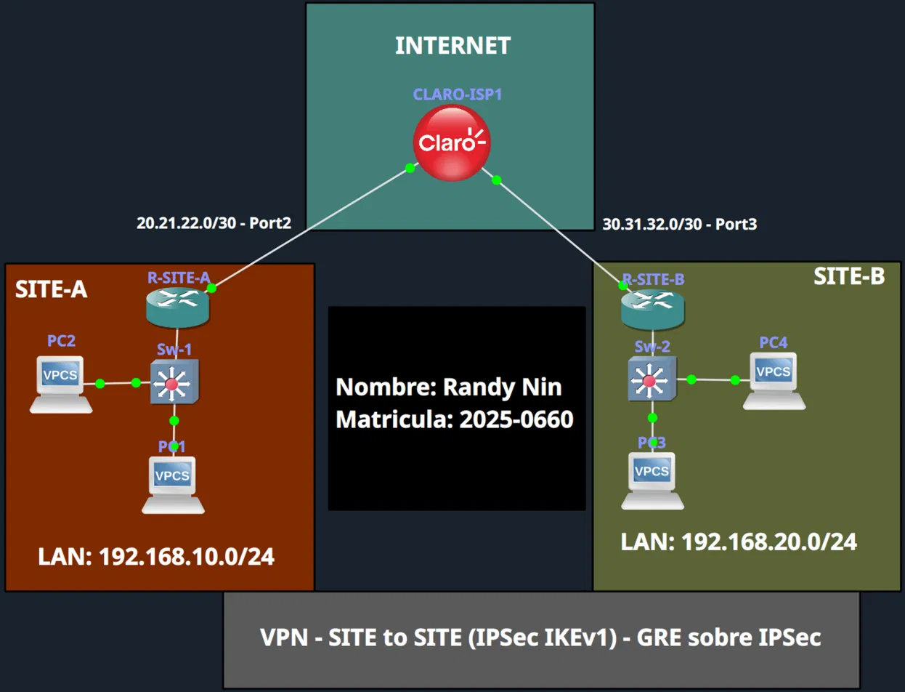

|Dispositivo|Interfaz|IP|Rol|
|:--|:--|:--|:--|
|CLARO-ISP|Gi0/1|20.21.22.2/30|Enlace hacia SITE-A|
|CLARO-ISP|Gi0/2|30.31.32.2/30|Enlace hacia SITE-B|
|R-SITE-A|Gi0/0|192.168.10.1/24|Gateway LAN SITE-A|
|R-SITE-A|Gi0/1|20.21.22.1/30|WAN / crypto map|
|R-SITE-A|Tunnel0|172.16.0.1/30|GRE endpoint|
|R-SITE-B|Gi0/0|192.168.20.1/24|Gateway LAN SITE-B|
|R-SITE-B|Gi0/2|30.31.32.1/30|WAN / crypto map|
|R-SITE-B|Tunnel0|172.16.0.2/30|GRE endpoint|

---

## Diferencia clave vs métodos anteriores

|Aspecto|Policy-Based|VTI Route-Based|GRE over IPSec (este lab)|
|:--|:--|:--|:--|
|Modo IPSec|Tunnel|Tunnel|**Transport**|
|Tunnel mode|N/A|`ipsec ipv4`|**`gre ip`**|
|ACL|Subredes LAN|N/A (rutas)|**`permit gre` entre IPs WAN**|
|OSPF|No soportado|Soportado|**Soportado (multicast nativo por GRE)**|
|Base para DMVPN|No|No|**Sí**|

---

## Interfaces verificadas

**R-SITE-A:**

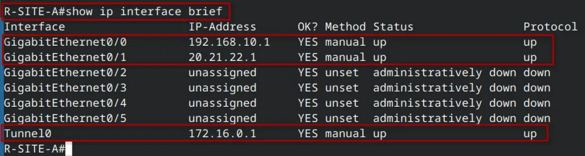

**R-SITE-B:**

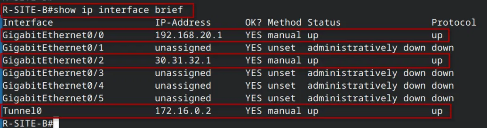

---

## Configuración VPN

El archivo de configuración completo está disponible en [`gre-ipsec`](https://claude.ai/chat/gre-ipsec). Bloques clave:

**Fase 1: política ISAKMP (simétrica)**

```
crypto isakmp policy 10
 encryption aes 256
 hash sha256
 authentication pre-share
 group 14
 lifetime 86400
```

**Fase 2: transform-set en modo transport**

```
crypto ipsec transform-set TRANF_SET esp-aes 256 esp-sha256-hmac
 mode transport
```

**ACL de tráfico GRE + crypto map**

```
! En R-SITE-A:
ip access-list extended VPN_GRE_IPSEC
 permit gre host 20.21.22.1 host 30.31.32.1

crypto map CMAP_SITEA 10 ipsec-isakmp
 set peer 30.31.32.1
 set transform-set TRANF_SET
 set pfs group14
 match address VPN_GRE_IPSEC

interface GigabitEthernet0/1
 crypto map CMAP_SITEA
```

**Tunnel GRE + OSPF**

```
! En R-SITE-A:
interface Tunnel0
 ip address 172.16.0.1 255.255.255.252
 tunnel source GigabitEthernet0/1
 tunnel destination 30.31.32.1
 tunnel mode gre ip

router ospf 10
 network 192.168.10.0 0.0.0.255 area 0
 network 172.16.0.0 0.0.0.3 area 0
```

---

## Antes de la VPN: sin conectividad

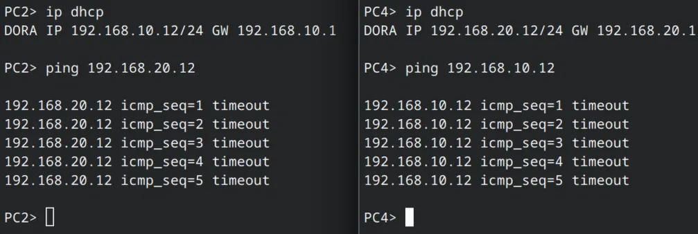

---

## Negociación IKEv1

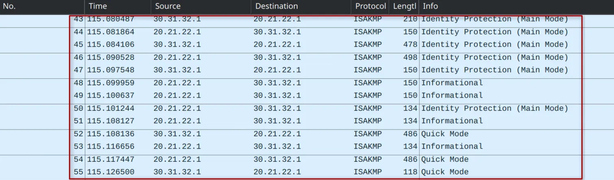

---

## Tráfico cifrado con ESP

Los paquetes ESP muestran tamaños variables (138-202 bytes) porque GRE encapsula diferentes tipos de tráfico: ICMP (pings), OSPF Hello, OSPF LSAs.

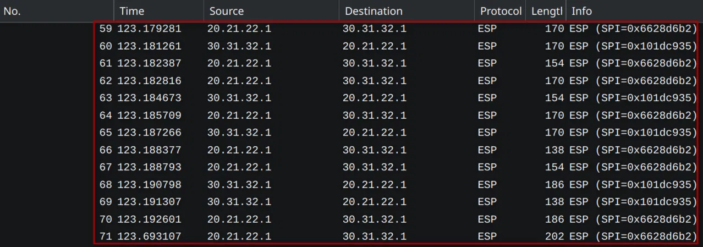

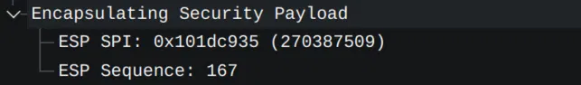

---

## Conectividad establecida

Sin timeout en el primer ping porque el tunnel ya estaba establecido por los OSPF Hellos.

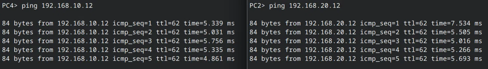

---

## Verificación del tunnel

### show crypto isakmp sa

**R-SITE-A:**

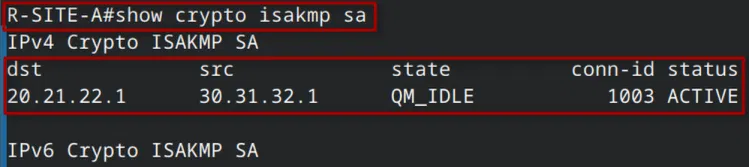

**R-SITE-B:**

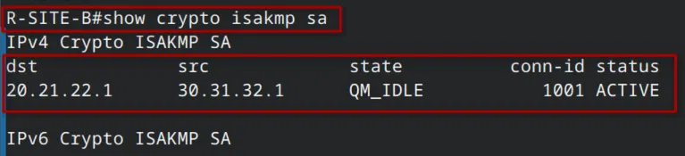

---

### show crypto ipsec sa

Selectores: protocolo 47 (GRE) entre IPs WAN. Modo: Transport. Interfaz: WAN física.

**R-SITE-A:**

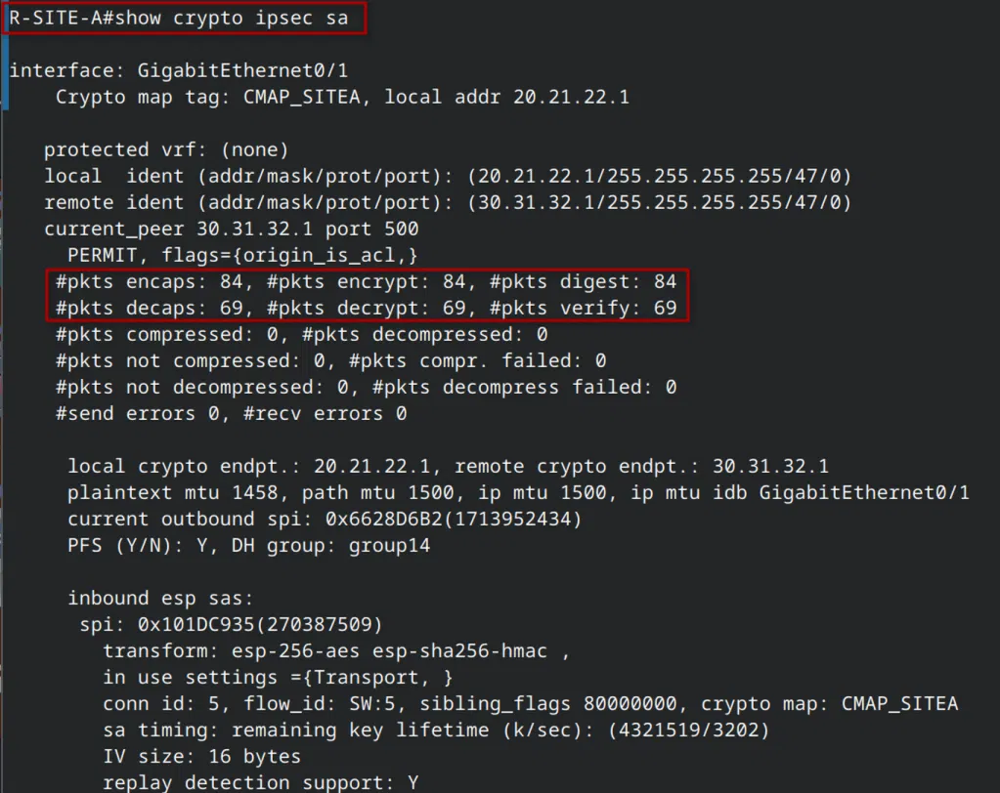

**R-SITE-B:**

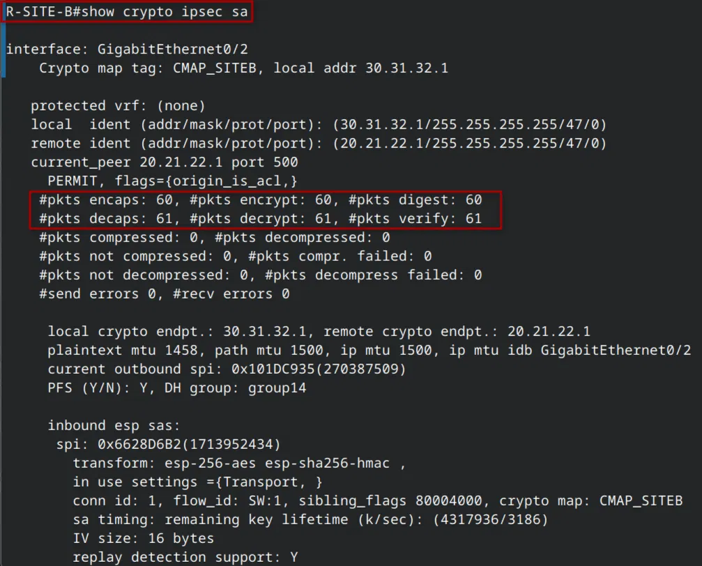

|Contador|R-SITE-A|R-SITE-B|
|:--|:-:|:-:|
|encaps / encrypt / digest|84 / 84 / 84|60 / 60 / 60|
|decaps / decrypt / verify|69 / 69 / 69|61 / 61 / 61|
|Outbound SPI|0x6628D6B2|0x101DC935|
|Inbound SPI|0x101DC935|0x6628D6B2|

Los contadores son más altos que en labs anteriores debido al tráfico continuo de OSPF Hellos cifrado por el tunnel.

---

### show ip ospf neighbor

Adyacencia OSPF en estado FULL a través de Tunnel0, confirmando que GRE transporta el multicast de OSPF correctamente y las rutas se propagan de forma dinámica.

**R-SITE-A:**

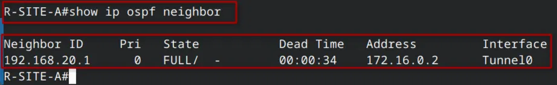

**R-SITE-B:**

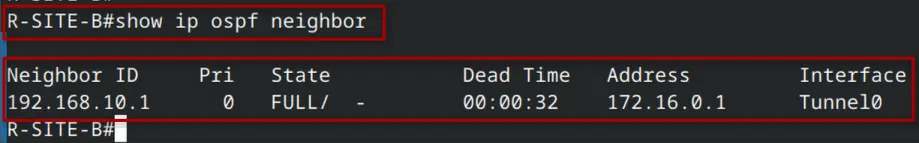

---

## Video demostrativo

**LINK:** [https://youtu.be/Qg3BhkRiEqc](https://youtu.be/Qg3BhkRiEqc)

---

_Randy Nin / Matrícula 2025-0660_

---
